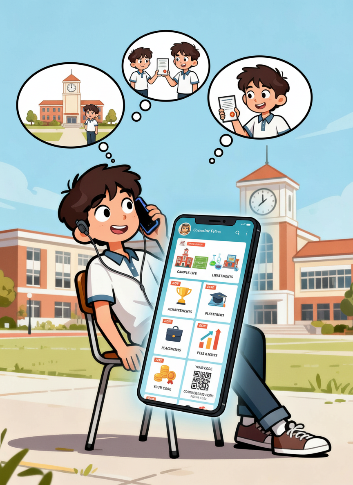

## 📚 Evidence for Visual-Interactive Communication

Multiple academic studies and industry reports consistently show that **visual-rich content increases comprehension, retention, engagement, and decision clarity** compared to text-only or voice-only communication. Below are validated insights.

| **Study / Source** | **Key Finding** | **Notes** | **Reference** |
|---------------------|------------------|-----------|----------------|
| Purdue University (2006) | Visuals + simple text significantly improved comprehension & recall over text-only instructions. | Strong impact in complex decision-making scenarios. | Pictures-as-worth-a-thousand-words |
| University of Minnesota – Multimedia Learning Research | Participants exposed to **text + visuals** retained more information than those receiving text alone. | Supports dual-coding & cognitive load theory. | University of Minnesota Learning & Education Studies |
| Marketing Industry Case Studies (various) | Visual campaigns commonly see **20–60% higher engagement or conversions** compared to text-only campaigns. | Range varies by sector & medium. | HubSpot, Content Marketing Institute, Wyzowl Reports |
| MIT Cognitive Science Research | Humans process visuals **60,000× faster** than text; visuals reduce cognitive load in decision-making. | Helps users understand options more clearly and faster. | MIT Visual Neuroscience & Cognition Lab |
| Meta–Kantar India Consumer Messaging Study | More than 70% of Indians prefer messaging businesses rather than calling, emailing, or visiting websites. | Indicates strong national preference for WhatsApp-style business communication. | Hindustan Times; The Economic Times |
| Meta–Kantar India Messaging Frequency Insight | 86% of Indian adults message a business at least once per week, among the highest globally. | Shows high habitual use of WhatsApp for business interactions. | The Economic Times; BMI Research |
| India Business Messaging Trend Reports | Messaging apps (mainly WhatsApp) are becoming the preferred channel for consumer–business interactions in India. | Supported by industry insights and business-messaging analyses. | HT Tech; Inc42 Media |

> 📈 **Insight:** Across domains — education, marketing, product design, and decision sciences — visual content consistently improves **engagement, comprehension, decision confidence, and memory**. This supports the idea that *visual-interactive AI experiences outperform voice-only communication*.

---

<table>
<tr>
<td width="50%" align="center" valign="middle">

</td>
<td width="60%" valign="top">

### 🧠 Why This Matters for BillianceAI

- Students understand complex admission data **faster** when visuals support voice.  
- Visual walkthroughs keep students **engaged longer**, reducing drop-offs in enquiry calls.  
- Professional visual decks build **trust & perceived institutional quality**.  
- Voice-only calls become monotonous; visuals introduce **clarity, flow, and storytelling**.  
- This hybrid approach aligns with proven cognitive and marketing research on effective communication.

</td>
</tr>
</table>

---

### 💡 Summary

Visual content is not just decoration — it's a scientifically validated enhancement to **decision-making, comprehension, trust, and engagement**.  
BillianceAI -  making information clearer and decisions faster.
> ✨ Turning calls into **visual storytelling journeys**
